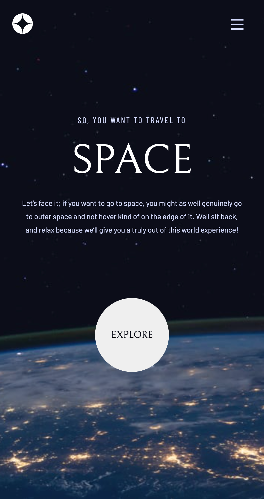
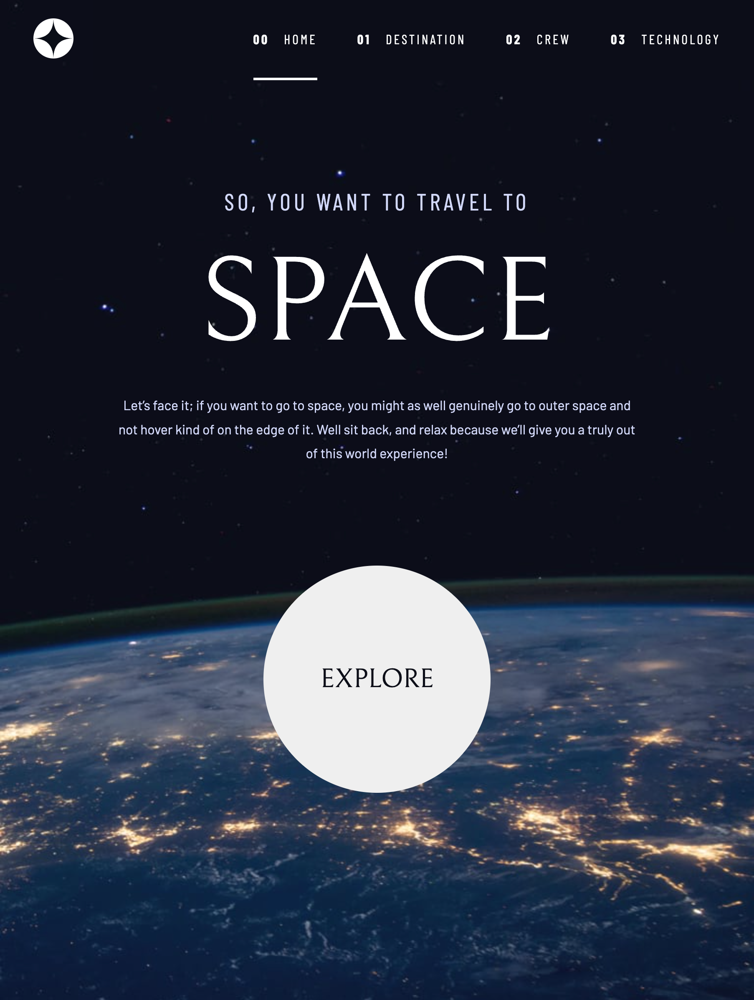
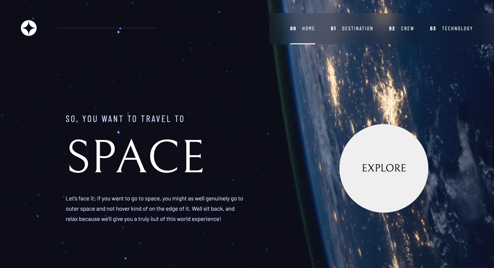

# Frontend Mentor - Space tourism website solution

## Table of contents

- [Overview](#overview)
  - [The challenge](#the-challenge)
  - [Screenshot](#screenshot)
  - [Links](#links)
- [My process](#my-process)
  - [Built with](#built-with)
  - [What I learned](#what-i-learned)
  - [Continued development](#continued-development)
- [Author](#author)

## Overview

### The challenge

Users should be able to:

- [X] View the optimal layout for each of the website's pages depending on their device's screen size
- [X] See hover states for all interactive elements on the page
- [X] View each page and be able to toggle between the tabs to see new information

### Screenshot

 
 
 

### Links
- Live Site URL: [My Solution](https://jen-464.github.io/space-tourism/)

## My process

### Built with

- Semantic HTML5 markup
- CSS custom properties
- Flexbox
- CSS Grid
- Mobile-first workflow
- [React](https://reactjs.org/) - JS library
- [TypeScript](https://www.typescriptlang.org/) - React framework

### What I learned

I learned how to deploy with React / Vite / Typescript which I had been unsuccessful in the past. It was one of the harder challenges I've encountered so far as there were several aspects to take into account: json data, responsivenes, hover / action / focus states, routing elements and the fact that I'm in the process of learning React. The importance of: having a public folder, keeping a consistent folder structure and knowing the order of my stylesheet files, was well ingrained into my brain.

### Continued development

As I continue developing, I'd like to understand React and its hooks better as well as use Material UI and GraphQL. For my next challenge, I'm to use Material UI and create reausable components that can be edited for unique instances.

## Author

- Website - [Jennifer Lopez](https://github.com/Jen-464/PortfolioGC)
- Frontend Mentor - [@Jen-464](https://www.frontendmentor.io/profile/Jen-464)
- LinkedIn - [@Jen464](https://www.linkedin.com/in/jen464/)
